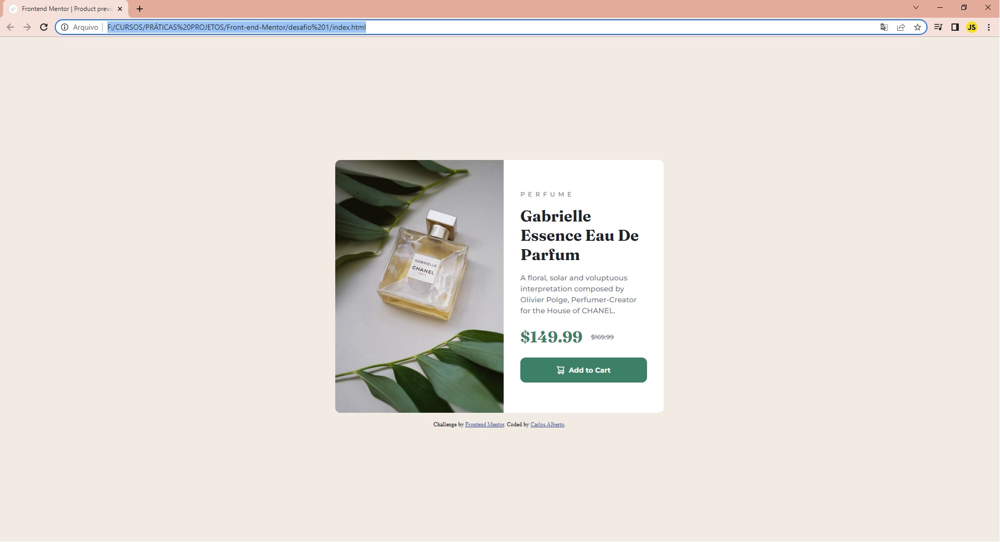

# Frontend Mentor - Solução de projeto de cartão de visualização do produto

Essa é uma solução para o [Product preview card component challenge on Frontend Mentor](https://www.frontendmentor.io/challenges/product-preview-card-component-GO7UmttRfa). Os desafios do Frontend Mentor ajudam você a melhorar suas habilidades de codificação criando projetos realistas.

## Índice

- [Visão_geral](#visão_geral)
  - [O desafio](#o-desafio)
  - [Screenshot](#screenshot)
  - [Links](#links)
- [Meu processo](#meu-processo)
  - [Feito com](#feito-com)   
- [Autor](#autor)

## Visão_geral

### O desafio

Os usuários devem ser capazes de:

- Ver o layout ideal dependendo do tamanho da tela do dispositivo
- Ver os estados de foco para elementos interativos

### Screenshot

### Links

- URL solução: [Add solution URL here](https://your-solution-url.com)
- Live Site URL: [Add live site URL here](https://your-live-site-url.com)

## Meu processo

### Feito com

- Semantica de marcação HTML5
- Propriedades de estilos CSS
- Flexbox
- Mobile-first workflow

## Autor

- Frontend Mentor - [@CarlosAlberto-FrontEnd](https://www.frontendmentor.io/profile/CarlosAlberto-FrontEnd)

